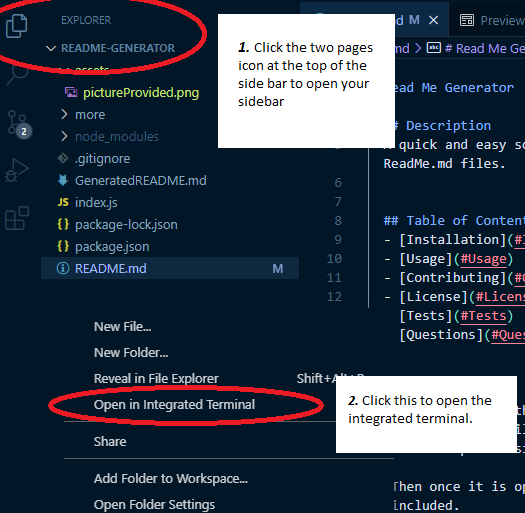
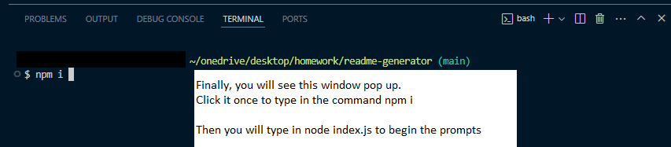

# Read Me Generator
  
  ## Description 
  A quick and easy solution to having to retype the same structure for all of your ReadMe.md files. 

  ## Table of Contents
  - [Installation](#Installation)
  - [Usage](#Usage)
  - [Contributing](#Contributors)
  - [License](#License)
  - [Tests](#Tests)
  - [Questions](#Questions)

  
  ## Installation 
   First, download the related npm. 
   To do this you will have to open the terminal in your code file by right clicking on the explorer sidebar. 
   
   Then once it is open type npm i so that all required package.json files will be included. 
   
   Then run node index.js. 
   
   After these two steps all you will have to do is enter your submissions as they appear on the terminal.

   Click [here](https://www.youtube.com/watch?v=CnnM_oVGlDM) to view the application at work.

  

  
  
  ## Usage 
  To generate as many read me's as you want.
  
  ## License 
    N/A

  ## Contributors 
  I wrote the base code, GitHub resources found [here](https://gist.github.com/lukas-h/2a5d00690736b4c3a7ba) were responsible for all License badges and information.

 